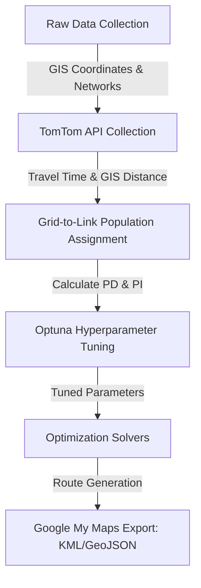

# Feeder Bus Route Optimization for Metro Station National University (VNU-HCM)

This repository contains the complete code, dataset, and research outputs for the undergraduate thesis project: **"Feeder Bus Network Design Optimization for VNU-HCM Study Area"**.

* **Author:** Trần Duy Quân (Student ID: IELSIU21046)
* **Supervisor:** TS. Phạm Huỳnh Trâm
* **Institution:** School of Systems Engineering, International University, Vietnam National University - Ho Chi Minh City (VNU-HCM)
* **Main Thesis Document:** [146_Trần Duy Quân_IELSIU21046_TS. Phạm Huỳnh Trâm.pdf](file:///./146_Trần Duy Quân_IELSIU21046_TS. Phạm Huỳnh Trâm.pdf)

---

## 📌 Interactive Map & Route Visualization

To see the optimization outputs directly on the road network, check the interactive Google My Maps routing visualization:

👉 **[VNU-HCM Feeder Bus Route Google My Maps Visualization](https://www.google.com/maps/d/u/0/viewer?mid=1Hz9I7NIP066gaCz8Dap8rGRkBNpko8U&ll=10.872256057550484%2C106.80297439924676&z=14)**

This interactive map displays:
- The 92 candidate bus stations inside the VNU-HCM campus area.
- The start/end terminal at **Metro Station National University (Station ID: 31)**.
- Optimal route comparison traces computed by the Genetic Algorithm (GA), Ant Colony Optimization (ACO), and the exact Pulse Algorithm.

---

## 📖 Research Background

Developing efficient first-mile public transit services is critical for linking university campuses and dense urban zones to mass rapid transit systems (e.g., Metro Line 1 in HCMC). This project models the **Feeder Bus Network Design Problem (FBNDP)** as a constrained shortest path routing problem. 

### Objective Function
The objective is to **maximize the Total Priority Index (PI)** of the route. The Priority Index rank-orders links based on their potential demand density ($PD_{ij}$) and proximity to the rail station:
$$PD_{ij} = \frac{\text{Population}_{ij}}{\text{Access Distance}_{ij}} \times L_{ij}$$
where $L_{ij}$ is the distance from the link midpoint to the target metro station, penalizing routes that wander too far from the final transfer node.

### Constraints
1. **Route Closure**: The route must start and end at the Metro Station terminal (Station ID: 31).
2. **Time Budget ($T_{\max}$)**: Total route travel time cannot exceed a specified budget (e.g., 18 minutes or 45 minutes).
3. **Directed Link Exclusion**: If a route utilizes a directed link ($u \rightarrow v$), it cannot also use its backward representation ($v \rightarrow u$) to avoid passenger demand double-counting.
4. **Simple Routing**: The route cannot visit the same station more than once (no sub-loops), except for the final return to the metro terminal.

---

## 🛠️ Methodology & Technical Stack

The pipeline consists of three core phases:



1. **GIS Routing Collection (`TomTom_data_retrieve.ipynb`)**: Retrieves exact road-network travel distances and travel times using the TomTom Routing API. Refined using sequential attempts (bus mode fallback to car mode) and spatial boundaries constraint.
2. **Demographics Mapping (`Grid_Link_Assignment.ipynb`)**: Integrates population density counts from Google Earth Engine, matching grid centroids (25m/50m/100m sizes) to road links based on a logit-mode catchment rule (950m catchment radius).
3. **Optuna Parameter Tuning**: Implements Tree-structured Parzen Estimator (TPE) samplers to dynamically optimize search parameters (population sizes, crossover/mutation rates, pheromone weights, and exploration margins) for GA and ACO.
4. **Optimization Solvers**:
   - **Pulse Solver (`Pulse_Algorithm.ipynb`)**: An exact depth-first search solver leveraging reverse Dijkstra lower bounds, time resource bounds, and fractional-knapsack bounding to certify global optimality.
   - **Genetic Algorithm (`GA.ipynb`)**: Meta-heuristic using route-preserving crossover at common nodes and cut-and-regrow mutation.
   - **Ant Colony Optimization (`ACO.ipynb`)**: Agent-based meta-heuristic implementing Softmax route selection and elite ant pheromone reinforcement.

---

## 📊 Experimental Results

Comparison of optimization algorithms on the **100m grid resolution network** (comprising 92 stations and 271 directed links) under two travel time budgets:

### 1. ⏱️ Short Commute Budget ($T_{\max} = 18$ minutes)
| Metric | Genetic Algorithm (GA) | Ant Colony Optimization (ACO) | Pulse Solver (Exact) |
| :--- | :---: | :---: | :---: |
| **Optimality Status** | Feasible Heuristic | Feasible Heuristic | **Certified Global Optimum** |
| **Total Priority Index (PI)** | 749 | 749 | **749** |
| **Served Area (SAp %)** | 9.735% | 9.735% | **9.735%** |
| **Route Travel Time** | 17.56 min | 17.56 min | **17.56 min** |
| **Solver Execution Time** | 2.215 sec | 5.079 sec | **0.015 sec** |

### 2. ⏱️ Long Commute Budget ($T_{\max} = 45$ minutes)
| Metric | Genetic Algorithm (GA) | Ant Colony Optimization (ACO) | Pulse Solver (Exact) |
| :--- | :---: | :---: | :---: |
| **Optimality Status** | Local Heuristic Optimum | Local Heuristic Optimum | **Certified Global Optimum** |
| **Total Priority Index (PI)** | 2,815 | 2,815 | **2,851** (+$1.3\%$) |
| **Served Area (SAp %)** | 22.878% | 22.878% | **24.451%** (+$1.6\%$) |
| **Route Travel Time** | 44.49 min | 44.49 min | **44.94 min** |
| **Solver Execution Time** | **36.256 sec** | **65.874 sec** | 301.874 sec |

> [!TIP]
> **Key Insight:** For short route budgets, the exact Pulse Solver is extremely fast ($15\text{ ms}$) and certifies optimality. For larger route budgets (e.g., 45 mins), the search space expands exponentially. The exact solver takes around 5 minutes but finds a superior global route, whereas the GA and ACO meta-heuristics execute in under a minute but settle at a slightly lower local optimum.

---

## 📁 Repository Structure

```text
├── Code/                          # Preprocessing & Optimization Notebooks
│   ├── Grid_Link_Assignment.ipynb  # Spatial population matching
│   ├── TomTom_data_retrieve.ipynb  # GIS routing coordinates collector
│   ├── PyDepsResolver.ipynb        # Package dependencies utility
│   ├── GA.ipynb                    # Genetic Algorithm optimizer
│   ├── ACO.ipynb                   # Ant Colony Optimization optimizer
│   └── Pulse_Algorithm.ipynb       # Exact Pulse Solver optimizer
├── Data/                          # Preprocessed Input Datasets
│   ├── INPUT DATA.csv              # Output of demographic assignment
│   ├── Links_data.xlsx             # Base link network structure
│   ├── stations_coordinates.csv    # Master bus station locations
│   └── vnu_polygon_area.kmz        # Geographic study area boundary
├── Optuna_Hyperparameters/        # Selected Optuna experiment results
│   ├── 18min_parameters/
│   └── 45min_parameters/
├── Output/                        # Solver run summaries, KML, and HTML maps
│   ├── ACO/                        # Ant Colony run zips (18m & 45m)
│   ├── GA/                         # Genetic Algorithm run zips (18m & 45m)
│   └── PA/                         # Pulse Solver run zips (25m/50m/100m grids)
├── Key_References/                # Relevant literature referenced in thesis
└── README.md                      # Academic documentation and results overview
```

---

## 🚀 How to Run the Solvers

To run the notebooks locally or on Google Colab:

### 1. Requirements
Ensure you have Python 3.8+ installed. Install the necessary library dependencies:
```bash
pip install numpy pandas openpyxl requests shapely pyproj folium tqdm optuna
```

### 2. Preprocessing
1. **TomTom Data Retrieve**: If you need to rebuild spatial travel times, run `Code/TomTom_data_retrieve.ipynb`. Enter your TomTom Routing API key when prompted.
2. **Grid-to-Link Population Assignment**: Run `Code/Grid_Link_Assignment.ipynb` using `Links_data.xlsx` and your grid files from Google Earth Engine. This will output a standard `INPUT DATA.csv` containing the link priority indices ($PI$).

### 3. Running Optimizers
1. Open and run `Code/GA.ipynb` or `Code/ACO.ipynb`.
2. Toggle the variable `RUN_OPTUNA_TUNING = True` if you want to optimize hyperparameter settings, or keep it `False` to run the model using the preconfigured parameters.
3. Outputs (route sequences, KML maps for Google My Maps, and summary CSVs) will be generated inside the respective output folders.
