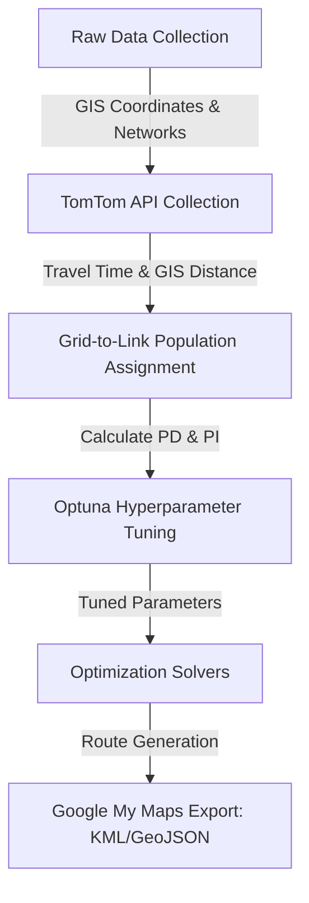

# Demand-Weighted Optimization of First-Mile Feeder Bus Routes for Metro Station Access: A Case Study of Ho Chi Minh City Metro

This repository contains the complete code, dataset, and research outputs for the undergraduate thesis project: **"Demand-Weighted Optimization of First-Mile Feeder Bus Routes for Metro Station Access: A Case Study of Ho Chi Minh City Metro"**.

* **Author:** Trần Duy Quân
* **Supervisor:** Dr. Pham Huynh Tram
* **Institution:** School of Industrial Engineering and Management, International University, Vietnam National University - Ho Chi Minh City (VNU-HCM)
* **Main Thesis Document:** [Demand-Weighted Optimization of First-Mile Feeder Bus.pdf](file:///./Demand-Weighted%20Optimization%20of%20First-Mile%20Feeder%20Bus.pdf)
* For more detail for the problem statement, background context and theoratical foundations of this thesis please find the thesis PDF file.

---

## 📌 Interactive Map & Route Visualization

To see the optimization outputs directly on the road network, check the interactive Google My Maps routing visualization:

👉 **[VNU-HCM Feeder Bus Route Google My Maps Visualization](https://www.google.com/maps/d/u/0/viewer?mid=1Hz9I7NIP066gaCz8Dap8rGRkBNpko8U&ll=10.872256057550484%2C106.80297439924676&z=14)**

This interactive map displays:
- The 92 candidate bus stations inside the VNU-HCM campus area.
- The start/end terminal at **Metro Station National University (Station ID: 31)**.
- Optimal route comparison traces computed by the Genetic Algorithm (GA), Ant Colony Optimization (ACO), and the exact Pulse Algorithm.

---

## 📖 Research Background & Study Area

Developing efficient first-mile public transit services is critical for linking university campuses and dense urban zones to mass rapid transit systems (e.g., Metro Line 1 in HCMC). This project models the **Feeder Bus Network Design Problem (FBNDP)** as a constrained shortest path routing problem. 

The figure below outlines the study area map containing candidate bus stations within the VNU-HCM campus zone:


---

## 📐 Mathematical Model

The Feeder Bus Network Design Problem is formulated mathematically on a graph network using population grids and walkability thresholds.

###  Indices and Sets
* $G = (N, A)$: Directed graph representing the candidate feeder bus network.
* $N$: Set of nodes (stations) in the transportation network.
* $s \in N$: Target metro station terminal, where $s = 31$ represents the **National University Metro Station**.
* $A$: Set of directed links (arcs) in the network.
* $(i, j) \in A$: Directed link (road segment) from station $i$ to station $j$.
* $Z$: Set of inhabited grids generated in the study area.
* $g \in Z$: Index of grid cell.
* $A_P \subseteq A$: Set of links contained in a selected path $P$.
* $L_{i,j} \in \{0, 1, 2\}$: Set of link types, where:
  * `0` = U-turn link (routing connector, zero population assigned).
  * `1` = Forward link (directional link containing direct demographic demand).
  * `2` = Backward link (counterpart of a Forward link, inherits forward demand metrics).
* $K \subseteq A_1$: Set of Forward source links that have at least one Backward counterpart.
* $k \in K$: Index of a Forward source link.
* $A_k^2 \subseteq A_2$: Set of Backward links whose forward source link is $k$.
* $P$: Selected circular feeder bus route.

### Parameters
* $pop_Z$: Total population of the inhabited zone.
* $\Delta_Z$: Total geographic area of the inhabited zone ($km^2$).
* $\lambda = \frac{pop_Z}{\Delta_Z}$: Population density of the inhabited zone (persons/$m^2$).
* $\Delta_g$: Area of grid cell $g$.
* $Pop_g = \lambda \Delta_g$: Population assigned to grid $g$ (derived from Google Earth Engine census-derived proxy counts).
* $s_{g,ij}$: Shortest perpendicular distance from the centroid of grid $g$ to link $(i, j)$ vector.
* $P_{g,ij}$: Probability that grid $g$ is associated with link $(i, j)$, modeled using a soft-assignment logit-based distance decay:
  $$P_{g,ij} = \frac{e^{-s_{g,ij}}}{\sum_{(m,n)\in A} e^{-s_{g,mn}}}, \quad \forall g \in Z, (i,j) \in A$$
* $Pop_{ij}$: Population served by link $(i, j)$, calculated by aggregating grid population values:
  $$Pop_{ij} = \sum_{g\in Z} Pop_g \times F_{g,ij}, \quad \forall (i, j) \in A$$
  *(For U-turn links, $Pop_{ij} = 0$).*
* $S_{ij}$: Average passenger walking access distance to link $(i, j)$, computed as a population-weighted average:
  $$S_{ij} = \frac{\sum_{g\in Z} Pop_g \times F_{g,ij} \times s_{g,ij}}{\sum_{g\in Z} Pop_g \times F_{g,ij}}, \quad \forall (i, j) \in A$$
  *(If no grids are assigned to link $(i, j)$, then $Pop_{ij} = 0$ and $S_{ij} = 0$).*
* $L_{ij}$: Straight-line distance between the midpoint of link $(i, j)$ and the target metro station $s$.
* $PD_{ij}$: Potential demand of link $(i, j)$, reflecting its demographic attractiveness:
  $$PD_{ij} = \begin{cases} \frac{Pop_{ij}}{S_{ij}} \times L_{ij}, & Pop_{ij} > 0 \text{ and } S_{ij} > 0 \\ 0, & \text{otherwise} \end{cases}, \quad \forall (i, j) \in A$$
* $\omega$: Sorted array of unique nonzero potential demand values: $\omega = [PD_1, PD_2, \dots, PD_n]$ where $PD_n > PD_{n-1} > 0$.
* $PI_{ij}$: Priority index of link $(i, j)$, obtained as the integer rank order of its potential demand in $\omega$:
  $$PI_{ij} = \begin{cases} 0, & PD_{ij} = 0 \\ \text{rank}(PD_{ij}), & PD_{ij} > 0 \end{cases}, \quad \forall (i, j) \in A$$
* $t_{ij}$: Road-network travel time of link $(i, j)$ in seconds (retrieved from TomTom API).
* $d_{ij}$: Road-network travel distance of link $(i, j)$ in meters (retrieved from TomTom API).
* $T$: Maximum allowable travel time budget for one feeder bus route (e.g., 18 or 45 minutes).
* $\Delta_{i,j}$: Grid catchment area assigned to link $(i, j)$:
  $$\Delta_{i,j} = \sum_{g\in Z} \Delta_g \times F_{g,ij}, \quad \forall (i, j) \in A$$

### Decision Variables
* $Y_{ij}$: Binary decision variable, equals 1 if directed link $(i, j)$ is selected in the final feeder bus route, and 0 otherwise.
* $F_{g,ij}$: Binary supporting variable, equals 1 if grid $g$ is assigned to link $(i, j)$, and 0 otherwise.

### Objective Function
The primary objective of the model is to maximize the total priority index (representing served demographic appeal) accumulated by the selected route:
$$\max Z = \sum_{(i,j)\in A} PI_{ij} Y_{ij}$$

### Constraints
The path must satisfy the following network topology and operational constraints:

1. **Travel Time Budget Limit**:
   $$\sum_{(i,j)\in A} t_{ij} Y_{ij} \le T \times 60$$
   This ensures that the total route travel time (in seconds) does not exceed the scenario time limit $T$ (converted to seconds).

2. **Metro Station Terminal Closure**:
   $$\sum_{j:(s,j)\in A} Y_{sj} = \sum_{i:(i,s)\in A} Y_{is} = 1$$
   Ensures the route starts at the metro station terminal ($s = 31$) and returns to it exactly once.

3. **Node Flow Conservation**:
   $$\sum_{j:(i,j)\in A} Y_{ij} = \sum_{h:(h,i)\in A} Y_{hi}, \quad \forall i \in N, i \ne s$$
   Enforces route continuity: at every intermediate node $i$, the number of selected incoming links must equal the number of selected outgoing links.

4. **Simple Routing (Sub-loop Prevention)**:
   $$\sum_{j:(i,j)\in A} Y_{ij} \le 1, \quad \forall i \in N, i \ne s$$
   $$\sum_{h:(h,i)\in A} Y_{hi} \le 1, \quad \forall i \in N, i \ne s$$
   Prevents route redundancy and repeated internal station visits: each intermediate node can be entered and exited at most once.

5. **Forward/Backward Mutual Link Exclusion**:
   $$Y_k + \sum_{(i,j)\in A_k^2} Y_{ij} \le 1, \quad \forall k \in K$$
   Prevents the route from utilizing both a Forward source link $k$ and its Backward counterparts. This enforces a single operational travel direction for each link and avoids double-counting demographic demand metrics.

6. **Walking Access Catchment Boundary**:
   $$s_{g,ij} \times F_{g,ij} \le 950, \quad \forall g \in Z, (i,j) \in A$$
   Restricts the assignment of grid cells to a candidate link only if the shortest distance from the grid centroid to the link vector is within the walkable catchment threshold ($950\text{ meters}$, which represents a typical maximum walking distance to public transport).

---

## 🛠️ Methodology & Technical Stack

The pipeline consists of three core phases:




### 💻 Languages & Technologies
- **Python (3.8+)**: Used for optimization solvers (GA, ACO, and exact Pulse Solver) and preprocessing (TomTom GIS retrieval, logit assignment).
- **JavaScript (Google Earth Engine API)**: Used for spatial gridding, household filtering, and population density dataset exports (detailed in Appendix A).

### 1. Preprocessing & GIS Data Retrieval
* **TomTom API Route Querying (`TomTom_data_retrieve.ipynb`)**: Resolves exact road-network travel distances and travel times. Implements fallback routines (bus mode $\rightarrow$ car mode $\rightarrow$ default mode) and spatial boundaries constraint.
* **Link Filtering (`Grid_Link_Assignment.ipynb`)**: Eliminates infeasible links (such as isolated road segments or restricted paths) to ensure topological connectivity.
  
<p align="center">
  
  
  
  <br>
  <em>Figure 9: Link Type Description (Forward, Backward, and U-turn link configurations)</em>
</p>


### 2. Demographics Mapping
* **Grid-to-Link Assignment**: Matches population grid cells from Google Earth Engine to adjacent road segments based on catchment distances.
  

### 3. Hyperparameter Tuning
* **Optuna Integration**: Automated optimization loops using Tree-structured Parzen Estimators (TPE) to tune heuristic parameters (population counts, crossover/mutation probabilities, elitism ratios) to maximize priority index capture.

### 4. Optimization Solvers
* **Pulse Solver (`Pulse_Algorithm.ipynb`)**: An exact depth-first search solver leveraging reverse Dijkstra lower bounds, time resource bounds, and fractional-knapsack bounding to certify global optimality.
* **Genetic Algorithm (`GA.ipynb`)**: Meta-heuristic using route-preserving crossover at common nodes and cut-and-regrow mutation.
* **Ant Colony Optimization (`ACO.ipynb`)**: Agent-based meta-heuristic implementing Softmax route selection and elite ant pheromone reinforcement.


---

## 📊 Experimental Results

Comparison of optimization algorithms on the **100m grid resolution network** (comprising 92 stations and 271 directed links) under two travel time budgets:

### 1. ⏱️ Short Commute Budget ($T_{\max} = 18$ minutes)
| Metric | Genetic Algorithm (GA) | Ant Colony Optimization (ACO) | Pulse Solver (Exact) |
| :--- | :---: | :---: | :---: |
| **Optimality Status** | Feasible Heuristic | Feasible Heuristic | **Certified Global Optimum** |
| **Total Priority Index (PI)** | 749 | 749 | **749** |
| **Served Area (SAp %)** | 9.735% | 9.735% | **9.735%** |
| **Route Travel Time** | 17.56 min | 17.56 min | **17.56 min** |
| **Solver Execution Time** | 2.215 sec | 5.079 sec | **0.015 sec** |

### 2. ⏱️ Long Commute Budget ($T_{\max} = 45$ minutes)
| Metric | Genetic Algorithm (GA) | Ant Colony Optimization (ACO) | Pulse Solver (Exact) |
| :--- | :---: | :---: | :---: |
| **Optimality Status** | Local Heuristic Optimum | Local Heuristic Optimum | **Certified Global Optimum** |
| **Total Priority Index (PI)** | 2,815 | 2,815 | **2,851** (+$1.3\%$) |
| **Served Area (SAp %)** | 22.878% | 22.878% | **24.451%** (+$1.6\%$) |
| **Route Travel Time** | 44.49 min | 44.49 min | **44.94 min** |
| **Solver Execution Time** | **36.256 sec** | **65.874 sec** | 301.874 sec |

> [!TIP]
> **Key Insight:** For short route budgets, the exact Pulse Solver is extremely fast ($15\text{ ms}$) and certifies optimality. For larger route budgets (e.g., 45 mins), the search space expands exponentially. The exact solver takes around 5 minutes but finds a superior global route, whereas the GA and ACO meta-heuristics execute in under a minute but settle at a slightly lower local optimum.

### Output Map Comparison
Please visit the visualization map here for detail output route paths:
👉 **[VNU-HCM Feeder Bus Route Google My Maps Visualization](https://www.google.com/maps/d/u/0/viewer?mid=1Hz9I7NIP066gaCz8Dap8rGRkBNpko8U&ll=10.872256057550484%2C106.80297439924676&z=14)**


**Below is the brief visualization of the optimal 18-minute routes generated by the models compared to the existing bus route 166:**


---

## 📁 Repository Structure

```text
├── Code/                          # Preprocessing & Optimization Notebooks
│   ├── Grid_Link_Assignment.ipynb  # Spatial population matching
│   ├── TomTom_data_retrieve.ipynb  # GIS routing coordinates collector
│   ├── PyDepsResolver.ipynb        # Package dependencies utility
│   ├── GA.ipynb                    # Genetic Algorithm optimizer
│   ├── ACO.ipynb                   # Ant Colony Optimization optimizer
│   ├── Pulse_Algorithm.ipynb       # Exact Pulse Solver optimizer
│   └── Google Earth Data retrieve.js # Google Earth Engine census-derived proxy counts script
├── Data/                          # Preprocessed Input Datasets
│   ├── INPUT DATA.csv              # Output of demographic assignment
│   ├── Links_data.xlsx             # Base link network structure
│   ├── stations_coordinates.csv    # Master bus station locations
│   └── vnu_polygon_area.kmz        # Geographic study area boundary
├── Optuna Hypeparameters/         # Selected Optuna experiment results
│   ├── 18min_parameters/          # Best parameters for 18-minute route budget
│   └── 45min_parameters/          # Best parameters for 45-minute route budget
├── Others/                        # Secondary assets and references
│   ├── Key References/            # Relevant literature referenced in thesis
│   └── Pictures/                  # Relevant thesis figures and visualization assets
├── Output/                        # Solver run summaries, KML, and HTML maps
│   ├── ACO/                        # Ant Colony run zips (18m & 45m)
│   ├── GA/                         # Genetic Algorithm run zips (18m & 45m)
│   └── PA/                         # Pulse Solver run zips (25m/50m/100m grids)
└── README.md                      # Academic documentation and results overview
```

---

## 🚀 How to Run the Solvers

To run the notebooks locally or on Google Colab:

### 1. Requirements
Ensure you have Python 3.8+ installed. Install the necessary library dependencies:
```bash
pip install numpy pandas openpyxl requests shapely pyproj folium tqdm optuna
```

### 2. Preprocessing
1. **TomTom Data Retrieve**: If you need to rebuild spatial travel times, run `Code/TomTom_data_retrieve.ipynb`. Enter your TomTom Routing API key when prompted.
2. **Grid-to-Link Population Assignment**: Run `Code/Grid_Link_Assignment.ipynb` using `Links_data.xlsx` and your grid files from Google Earth Engine. This will output a standard `INPUT DATA.csv` containing the link priority indices ($PI$).

### 3. Running Optimizers
1. Open and run `Code/GA.ipynb` or `Code/ACO.ipynb`.
2. Toggle the variable `RUN_OPTUNA_TUNING = True` if you want to optimize hyperparameter settings, or keep it `False` to run the model using the preconfigured parameters.
3. Outputs (route sequences, KML maps for Google My Maps, and summary CSVs) will be generated inside the respective output folders.

---

## 📚 References

1. **Hemdan, S., Ramadan, M., Alsultan, A., & Othman, A. (2026).** Optimization of feeder buses route to connect high-speed railway stations with urban areas. *Engineering Proceedings*, 121(6). [https://doi.org/10.3390/engproc2025121006](https://doi.org/10.3390/engproc2025121006)
2. **Zhu, Z., Guo, X., Zeng, J., & Zhang, S. (2017).** Route design model of feeder bus service for urban rail transit stations. *Mathematical Problems in Engineering*, 2017, Article 1090457. [https://doi.org/10.1155/2017/1090457](https://doi.org/10.1155/2017/1090457)
3. **Wei, Y., Jiang, N., Li, Z., Zheng, D., Chen, M., & Zhang, M. (2022).** An improved ant colony algorithm for urban bus network optimization based on existing bus routes. *ISPRS International Journal of Geo-Information*, 11(5), Article 317. [https://doi.org/10.3390/ijgi11050317](https://doi.org/10.3390/ijgi11050317)
4. **Lozano, L., & Medaglia, A. L. (2013).** On an exact method for the constrained shortest path problem. *Computers & Operations Research*, 40(1), 378–384. [https://doi.org/10.1016/j.cor.2012.07.008](https://doi.org/10.1016/j.cor.2012.07.008)
5. **Kuah, G. K., & Perl, J. (1989).** The feeder-bus network-design problem. *Journal of the Operational Research Society*, 40(8), 751–767. [https://doi.org/10.1057/jors.1989.122](https://doi.org/10.1057/jors.1989.122)
6. **Ozaki, Y., Watanabe, S., & Yanase, T. (2025).** OptunaHub: A Platform for Black-Box Optimization (arXiv:2510.02798). *arXiv*. [https://doi.org/10.48550/arXiv.2510.02798](https://doi.org/10.48550/arXiv.2510.02798)
7. **Calabrò, G., Le Pira, M., Inturri, G., Ignaccolo, M., & Pluchino, A. (2023).** A simulation-optimization approach to solve the first and last mile of mass rapid transit via feeder services. *Transportation Research Procedia*, 69, 767–774. [https://doi.org/10.1016/j.trpro.2023.02.234](https://doi.org/10.1016/j.trpro.2023.02.234)
8. **Zhen, L., & Gu, W. (2024).** Feeder bus service design under spatially heterogeneous demand. *Transportation Research Part A: Policy and Practice*, 189, 104214. [https://doi.org/10.1016/j.tra.2024.104214](https://doi.org/10.1016/j.tra.2024.104214)
9. **Su, Y., & Yang, H. (2025).** Enhancing feeder bus service coverage with Multi-Agent Reinforcement Learning: A case study in Hong Kong. *Transportation Research Part E: Logistics and Transportation Review*, 196, 103997. [https://doi.org/10.1016/j.tre.2025.103997](https://doi.org/10.1016/j.tre.2025.103997)
10. **Huu, D. N., & Ngoc, V. N. (2021).** Analysis study of current transportation status in Vietnam’s urban traffic and the transition to electric two-wheelers mobility. *Sustainability*, 13(10), Article 5577. [https://doi.org/10.3390/su13105577](https://doi.org/10.3390/su13105577)

---

## 👥 Contributors
* **Trần Duy Quân** - Lead Researcher & Author
* **Dr. Pham Huynh Tram** - Advisor & Supervisor
* **ChatGPT (OpenAI)** - Technical assistant for code refinement, debugging, and repository structuring.

---

## 📄 License
This project is licensed under the MIT License - see the [LICENSE](LICENSE) file for details.
